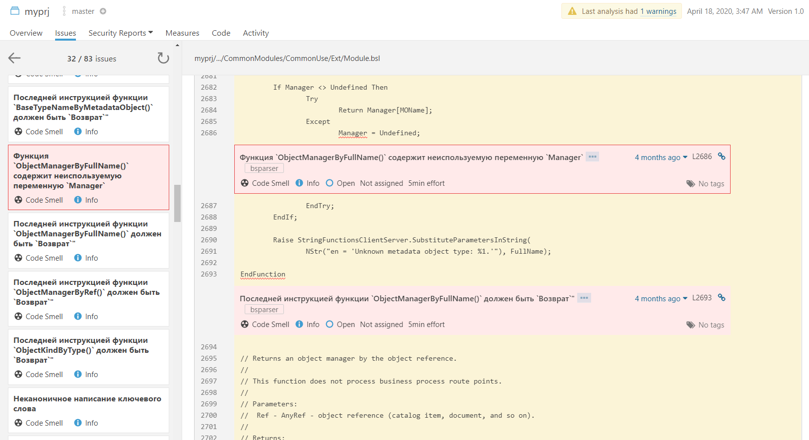
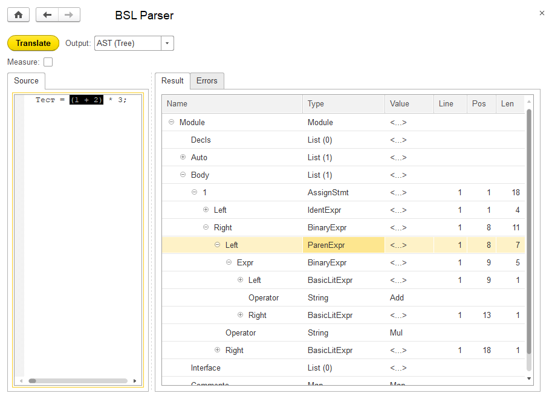

# bsparser (built-in script parser)

## Парсер встроенного языка платформы 1С:Предприятие 8

По всем вопросам можно обращаться в личку: https://t.me/astsukanov

Видео (немного устарело): [Процесс написания плагина для bsparser](https://www.youtube.com/watch?v=wjDeQ6sFCxE)

Документация: [Книга Джедая](book.md)

Данный проект представляет из себя набор внешних обработок для платформы 1С:Предприятие версии 8.3.13

Обработки совместимы с интерпретатором [OneScript](https://github.com/EvilBeaver/OneScript)

## Содержание

1. [Введение](#введение)
2. [Цели проекта](#цели-проекта)
3. [Мотивация](#мотивация)
4. [Философия](#философия)
5. [Структура репозитория](#структура-репозитория)
6. [Системные требования](#системные-требования)
7. [Сборка проекта](#сборка-проекта)
8. [Быстрый старт](#быстрый-старт)
9. [Принцип работы](#принцип-работы)

## Введение

Перед тем как разбираться с этим проектом, убедитесь что вы хорошо понимаете что такое AST и Visitor и что можно с их помощью делать.
Это важно, так как данная разработка предоставляет именно эти возможности. Не больше не меньше.
Вы можете писать проверки кода, компиляторы, интерпретаторы и любые другие вещи, которые можно реализовать путем обработки AST.
Сколько информации содержит AST можно увидеть тут: https://lead-tools.github.io/bsparser

Общее представление можно получить в этой статье: [Зачем нужен AST](https://ps-group.github.io/compilers/ast)

Данная разработка устроена похожим образом. С поправкой на то, что это реализация без ООП на языке 1С.
После ознакомления со статьей можно сразу посмотреть [Принцип работы](#принцип-работы) внизу этой страницы.

По сути это фронтенд компилятора, а вы можете к нему писать бакенды (плагины).

Пример плагина проверяющего наличие возврата в конце функций: [ДетекторФункцийБезВозвратаВКонце](https://github.com/lead-tools/bsparser/blob/master/plugins/ДетекторФункцийБезВозвратаВКонце/src/ДетекторФункцийБезВозвратаВКонце/Ext/ObjectModule.bsl)

Конкретно весь код проверки выглядит так (остальное там просто интерфейс плагина):

```bsl
Процедура ПосетитьОбъявлениеМетода(ОбъявлениеМетода) Экспорт
    Перем КоличествоОператоров;
    Если ОбъявлениеМетода.Сигнатура.Тип <> Типы.ОбъявлениеСигнатурыФункции Тогда
        Возврат;
    КонецЕсли;
    КоличествоОператоров = ОбъявлениеМетода.Операторы.Количество();
    Если КоличествоОператоров = 0 Или ОбъявлениеМетода.Операторы[КоличествоОператоров - 1].Тип <> Типы.ОператорВозврат Тогда
        Текст = СтрШаблон("Последней инструкцией функции `%1()` должен быть `Возврат`""", ОбъявлениеМетода.Сигнатура.Имя);
        Ошибка(Текст, ОбъявлениеМетода.Конец);
    КонецЕсли;
КонецПроцедуры
```

Эта процедура вызывается визитером (Visitor) во время обхода AST для каждой встреченной процедуры или функции.
Суть реализации проверки: Сначала проверяется что это функция. Затем берется количество операторов в теле функции.
Если 0 или последний оператор не `Возврат`, то регистрируется ошибка.

Пример плагина средней сложности: [ДетекторНеиспользуемыхПеременных](https://github.com/lead-tools/bsparser/blob/master/plugins/ДетекторНеиспользуемыхПеременных/src/ДетекторНеиспользуемыхПеременных/Ext/ObjectModule.bsl)
 (этот код находит неиспользуемые переменные и параметры)

Пример сложного бакенда: [Компилятор](https://github.com/lead-tools/bsparser/blob/master/backends/Компилятор/src/Компилятор/Ext/ObjectModule.bsl)
 (это генератор байткода, который работает идентично платформенному)

Пример на OneScript, демонстрирующий прогон проверок исходного кода: [test.os](https://github.com/lead-tools/bsparser/blob/master/oscript/test.os)

Пример на OneScript, демонстрирующий автоматическое исправление исходного кода: [test8.os](https://github.com/lead-tools/bsparser/blob/master/oscript/test8.os)

Пример выгрузки ошибок в [SonarQube](https://www.sonarqube.org/): [test7.os](https://github.com/lead-tools/bsparser/blob/master/oscript/test7.os)



## Цели проекта

* Создать удобный инструмент для работы с исходным кодом на языке 1С как с данными
* Выработать методы анализа и преобразования программ на языке 1С
* Выработать методы ограничения семантики языка под конкретную задачу или проект
* Получить новые знания и умения

## Мотивация

Разработка ПО практически никогда не ограничивается одними лишь правилами языка реализации. Многие команды следуют определенным общепринятым стандартам и правилам разработки, а каждый конкретный проект имеет еще и свою собственную специфику. Проверка проекта на соответствие всем требованиям - это довольно сложный и затратный процесс. А сократить затраты (кажется) можно с помощью автоматизации проверок. Эта мысль была толчком к началу работы над данным проектом.

## Философия

* Make it as simple as possible, but not simpler
* Не привлекай сторонних технологий без необходимости
* Не ведись на модные течения
* Не сцы

## Структура репозитория

* /docs - файлы веб-страницы проекта <https://lead-tools.github.io/bsparser>
* /console - исходники обработки-консоли, предоставляющей графический пользовательский интерфейс к парсеру (в целях отладки)
* /img - картинки для документации
* /examples - примеры
* /src - исходники обработки парсера
* /common.ps1 - скрипт с общими алгоритмами
* /build.ps1 - скрипт сборки обработок с помощью конфигуратора в пакетном режиме
* /explode.ps1 - скрипт разборки обработок с помощью конфигуратора в пакетном режиме
* /docgen.os - скрипт, генерирующий документацию в папке /docs
* /docgen.ps1 - обертка для запуска docgen.os

## Системные требования

Для использования обработок необходима либо установленная платформа 1С:Предприятие версии 8.3.13, либо интерпретатор [OneScript](https://github.com/EvilBeaver/OneScript)

Операционная система значения не имеет. Но сборочные скрипты в текущей реализации будут работать только в Windows (эти скрипты не обязательны).

Если вы хотите [принять участие](https://github.com/lead-tools/bsparser/blob/master/CONTRIBUTING.md) в проекте, то вероятно потребуется [git](https://git-scm.com/) и аккаунт на github.

## Сборка проекта

Вы можете либо клонировать репозиторий с помощью [git](https://git-scm.com/):

```ps
git clone https://github.com/lead-tools/bsparser
```

либо просто скачать и распаковать zip-архив: https://github.com/lead-tools/bsparser/archive/master.zip

Исходники обработок в данном проекте выгружены стандартными средствами конфигуратора платформы 1С:Предприятие версии 8.3.13. Для сборки вы можете просто открыть файл `xml` в конфигураторе как есть и пересохранить в формате `epf`

Также можно воспользоваться скриптами на **powershell**, которые находятся в корне. Для сборки обработок в папке `/build` нужно запустить скрипт `build.ps1`. Обратную операцию можно выполнить, запустив скрипт `explode.ps1`

Пользоваться скриптами нужно **осторожно**, чтобы не потерять свои правки.

Если вы будете использовать парсер в среде [OneScript](https://github.com/EvilBeaver/OneScript), то сборка вообще не требуется.

## Быстрый старт

1. Клонировать репозиторий и собрать обработки (см. выше "Сборка проекта")
2. Открыть обработку build/Консоль.epf в управляемом приложении любой файловой базы (обработка ПарсерВстроенногоЯзыка.epf должна лежать рядом с Консоль.epf)
3. Вставить исходный код на языке 1С в поле `Исходник`
4. В поле `Вывод` выбрать `АСД (Дерево)`
5. Нажать кнопку `Выполнить`
6. В поле `Результат` будет выведено [AST](https://ru.wikipedia.org/wiki/%D0%90%D0%B1%D1%81%D1%82%D1%80%D0%B0%D0%BA%D1%82%D0%BD%D0%BE%D0%B5_%D1%81%D0%B8%D0%BD%D1%82%D0%B0%D0%BA%D1%81%D0%B8%D1%87%D0%B5%D1%81%D0%BA%D0%BE%D0%B5_%D0%B4%D0%B5%D1%80%D0%B5%D0%B2%D0%BE) вашего исходного кода. Двойной клик на узле в дереве будет выделять соответствующий этому узлу участок исходного кода.
7. Для запуска плагина нужно в поле `Вывод` выбрать `Плагины` и указать файл обработки-плагина. Затем нажать `Выполнить`. В поле `Результат` будет выведен результат работы плагина, если он возвращает текст. В таблице ошибок будут собранные плагином ошибки. Двойной клик на ошибке будет выделять соответствующий участок исходного кода.

**Внимание!** Режим отладки существенно снижает скорость работы парсера.



## Принцип работы

Решение на базе данного проекта в простейшем случае включает:

* Парсер - обработка ПарсерВстроенногоЯзыка.epf из этого репозитория
* Плагин к парсеру - любая обработка, имеющая определенный программный интерфейс

Парсер разбирает переданный ему исходный код и возвращает модель этого кода в виде [абстрактного синтаксического дерева](https://ru.wikipedia.org/wiki/%D0%90%D0%B1%D1%81%D1%82%D1%80%D0%B0%D0%BA%D1%82%D0%BD%D0%BE%D0%B5_%D1%81%D0%B8%D0%BD%D1%82%D0%B0%D0%BA%D1%81%D0%B8%D1%87%D0%B5%D1%81%D0%BA%D0%BE%D0%B5_%D0%B4%D0%B5%D1%80%D0%B5%D0%B2%D0%BE). Узлы этого дерева соответствуют синтаксическим конструкциям и операторам языка. Например, конструкция `Пока <условие> Цикл <тело> КонецЦикла` представлена в дереве узлами типа `ОператорПока`, в которых условие представлено в подчиненном узле-выражении `Выражение`, а тело хранится в массиве узлов-операторов `Операторы`. Данных в дереве достаточно для полного восстановления по нему исходного кода вместе с комментариями, за исключением некоторых деталей форматирования. Порядок и подчиненность узлов в дереве в точности соответствует исходному коду. Описание узлов и элементов дерева вы можете найти на веб-странице проекта: https://lead-tools.github.io/bsparser

После формирования дерева запускается общий механизм обхода (шаблон проектирования Visitor), который при посещении узла вызывает обработчики подписанных на этот узел плагинов. Полезная (прикладная) работа выполняется именно плагином. Это может быть сбор статистики, поиск ошибок, анализ цикломатической сложности, построение документации по коду и т.д. и т.п. Кроме того, плагин может построить модификацию исходного дерева путем замены одних узлов на другие (например, в целях оптимизации).

Состояние плагина (в переменных модуля обработки) сохраняется между вызовами до самого конца обхода дерева, а подписки на каждый узел возможны две: перед обходом узла и после обхода. Это существенно упрощает реализацию многих алгоритмов анализа. Плюс к этому, некоторую информацию предоставляет сам механизм обхода. Например, плагинам доступна статистика по родительским узлам (количество каждого вида).

## Благодарности

Спасибо жене, что терпит мои увлечения и приносит еду прям к компу, когда я на форсаже вечерами кодирую тонны никому не нужного кода.
